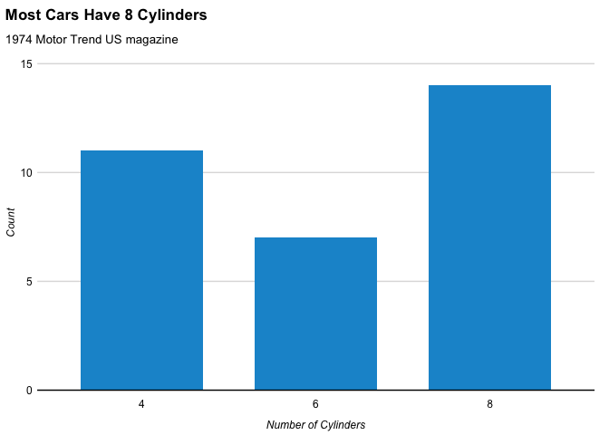
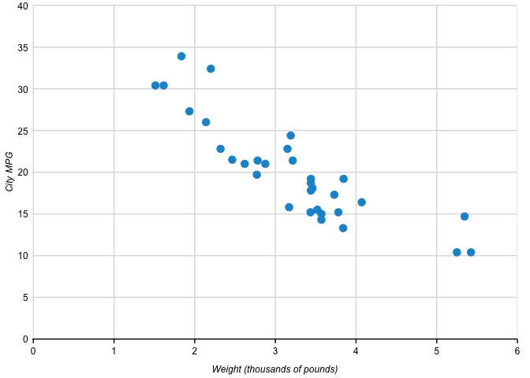
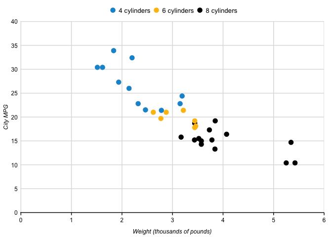
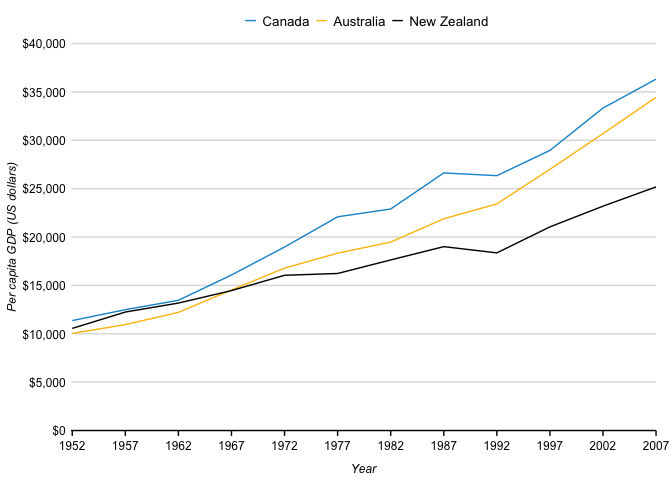
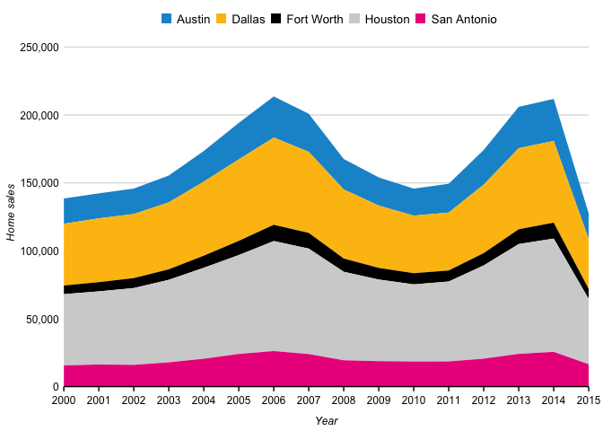
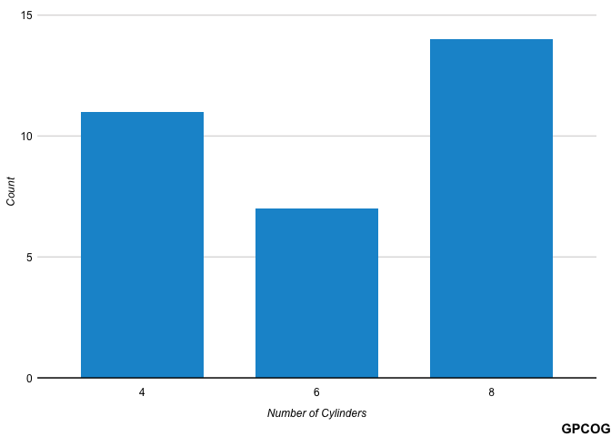
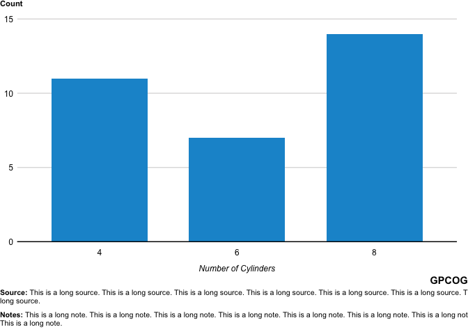

<!-- README.md is generated from README.Rmd. Please edit that file -->

# gpcogstyle <a href="https://www.github.com/GPCOG/gpcogstyle/"></a>

## Overview

`gpcogstyle` is a set of tools for creating GPCOG-themed plots and maps
in R. The package, which is based on the Urban Institute style guide,
extends `ggplot2` with print and map themes as well as tools that make
plotting easier at GPCOG.

A comprehensive set of examples is available at the [Urban Institute R
Users Group
website](https://UrbanInstitute.github.io/r-at-urban/graphics-guide.html).

## Installation

    install.packages("remotes")
    remotes::install_github("GPCOG/gpcogstyle", build_vignettes = TRUE)

## Fonts

Waffle charts with glyphs require fontawesome. `fontawesome_test()` and
`fontawesome_install()` are the fontawesome versions of the above
functions. Be sure to install fontawesome from
[here](https://github.com/hrbrmstr/waffle/tree/master/inst/fonts).

## Usage

Always load `library(gpcogstyle)` after `library(ggplot2)` or
`library(tidyverse)`.

``` r
library(tidyverse)
library(gpcogstyle)

set_gpcog_defaults(style = "print")

ggplot(data = mtcars, mapping = aes(factor(cyl))) +
  geom_bar() + 
  scale_y_continuous(expand = expansion(mult = c(0, 0.1))) +
  labs(x = "Number of Cylinders",
       y = "Count") +
  remove_ticks() +
  labs(title = "Most Cars Have 8 Cylinders",
       subtitle = "1974 Motor Trend US magazine")
```

<!-- -->

``` r
ggplot(data = mtcars, mapping = aes(x = wt, y = mpg)) +
  geom_point() +
  scale_x_continuous(expand = expansion(mult = c(0.002, 0)), 
                     limits = c(0, 6),
                     breaks = 0:6) +
  scale_y_continuous(expand = expansion(mult = c(0, 0.002)), 
                     limits = c(0, 40),
                     breaks = 0:8 * 5) +
  labs(x = "Weight (thousands of pounds)",
       y = "City MPG") +
  scatter_grid()
```

<!-- -->

``` r
mtcars %>%
  mutate(cyl = paste(cyl, "cylinders")) %>%
  ggplot(aes(x = wt, y = mpg, color = cyl)) +
  geom_point() +
  scale_x_continuous(expand = expansion(mult = c(0.002, 0)), 
                     limits = c(0, 6),
                     breaks = 0:6) +
  scale_y_continuous(expand = expansion(mult = c(0, 0.002)), 
                     limits = c(0, 40),
                     breaks = 0:8 * 5) +
  labs(x = "Weight (thousands of pounds)",
       y = "City MPG") +
  scatter_grid()
```

<!-- -->

``` r
library(gapminder)

gapminder %>%
  filter(country %in% c("Australia", "Canada", "New Zealand")) %>%
  mutate(country = factor(country, levels = c("Canada", "Australia", "New Zealand"))) %>%
  ggplot(aes(year, gdpPercap, color = country)) +
  geom_line() +
  scale_x_continuous(expand = expansion(mult = c(0.002, 0)), 
                     breaks = c(1952 + 0:12 * 5), 
                     limits = c(1952, 2007)) +
  scale_y_continuous(expand = expansion(mult = c(0, 0.002)), 
                     breaks = 0:8 * 5000,
                     labels = scales::dollar, 
                     limits = c(0, 40000)) +
  labs(x = "Year",
       y = "Per capita GDP (US dollars)")
```

<!-- -->

``` r
txhousing %>%
  filter(city %in% c("Austin","Houston","Dallas","San Antonio","Fort Worth")) %>%
  group_by(city, year) %>%
  summarize(sales = sum(sales)) %>%
  ggplot(aes(x = year, y = sales, fill = city)) +
  geom_area(position = "stack") +
  scale_x_continuous(expand = expansion(mult = c(0, 0)),
                     limits = c(2000, 2015),
                     breaks = 2000 + 0:15) +  
  scale_y_continuous(expand = expansion(mult = c(0, 0.2)), 
                     labels = scales::comma) +
  labs(x = "Year",
       y = "Home sales")
```

    #> `summarise()` has grouped output by 'city'. You can override using the
    #> `.groups` argument.

<!-- -->

## Branding

``` r
library(ggplot2)
library(gpcogstyle)

set_gpcog_defaults()

plot <- ggplot(data = mtcars, mapping = aes(factor(cyl))) +
  geom_bar() + 
  scale_y_continuous(expand = expansion(mult = c(0, 0.1))) +
  labs(x = "Number of Cylinders",
       y = "Count") +
  remove_ticks()

gpcog_plot(plot, gpcog_logo_text(), ncol = 1, heights = c(30, 1))
```

<!-- -->

## Notes and Sources

``` r
library(ggplot2)
library(gpcogstyle)

set_gpcog_defaults()

plot <- ggplot(data = mtcars, mapping = aes(factor(cyl))) +
  geom_bar() + 
  scale_y_continuous(expand = expansion(mult = c(0, 0.1))) +
  labs(x = "Number of Cylinders",
       y = NULL) +
  remove_ticks()

gpcog_plot(
  gpcog_y_title(string = "Count"),
  plot, 
  gpcog_logo_text(), 
  gpcog_source(text = "This is a long source. This is a long source. This is a long source. This is a long source. This is a long source. This is a long source. This is a long source. ",
              width = 155),
  gpcog_note(text = "This is a long note. This is a long note. This is a long note. This is a long note. This is a long note. This is a long note. This is a long note. This is a long note.",
            width = 155,
            plural = TRUE),
  ncol = 1, 
  heights = c(1, 30, 1.5, 2.5, 2.5)
)
```

<!-- -->

Core themes:

- `set_gpcog_defaults()`
- `theme_gpcog_print()`
- `theme_gpcog_map()`

Formatting functions:

- `gpcog_plot()`
- `gpcog_title()`
- `gpcog_subtitle()`
- `gpcog_y_title()`
- `gpcog_note()`
- `gpcog_source()`
- `gpcog_logo_text()`
- `scale_color_c()`
- `scale_color_d()`
- `scale_fill_c()`
- `scale_fill_d()`
- `scatter_grid()`
- `remove_ticks()`
- `add_axis()`
- `remove_axis()`
- `get_legend()`
- `remove_legend()`
- `gpcog_geofacet`

Color palettes:

- `GPCOG_seq_blue1`
- `GPCOG_seq_orange1`
- `GPCOG_qual1`
- `GPCOG_diverg1`
- `MDW_newcastle_future`
- `MDW_newcastle_affordability`
- `MDW_newcastle_income`
- `MDW_newcastle_households`
- `MDW_newcastle_relationship`
- `MDW_newcastle_sex`
- `MDW_newcastle_age`
- `MDW_newcastle_wage`
- `MDW_topsham_future`
- `MDW_topsham_wage`
- `MDW_topsham_permits`
- `MDW_topsham_employment`
- `MDW_topsham_households`
- `MDW_topsham_affordability`
- `MDW_topsham_age`
- `MDW_topsham_housing`
- `urbn_main`
- `urbn_diverging`
- `urbn_quintile`
- `urbn_politics`
- `urbn_cyan`
- `urbn_gray`
- `urbn_yellow`
- `urbn_magenta`
- `urbn_spacegray`
- `urbn_red`
- `brewer_BrBg`
- `brewer_BdBu`
- `brewer_BdGy`
- `brewer_BdGy`
- `brewer_blue`
- `brewer_green`
- `brewer_black`
- `brewer_orange`
- `brewer_purple`
- `brewer_red`
- `brewer_set1`
- `brewer_paired`
- `brewer_set3`
- `monopoly_colors`

Palette functions:

- `palette_urbn_main`
- `palette_urbn_diverging`
- `palette_urbn_quintile`
- `palette_urbn_politics`
- `palette_urbn_cyan`
- `palette_urbn_gray`
- `palette_urbn_yellow`
- `palette_urbn_magenta`
- `palette_urbn_green`
- `palette_urbn_spacegray`
- `palette_urbn_red`

Utility functions:

- `fontawesome_test()`
- `fontawesome_install()`
- `view_palette()`

In development:

- `undo_gpcog_defaults()`
- `save_gpcog_print()`

## Getting help

Contact [Abe Dailey](adailey@gpcog.org) with feedback or questions.

## Code of conduct

Please note that this project is released with a [Contributor Code of
Conduct](CODE_OF_CONDUCT.md). By participating in this project you agree
to abide by its terms.
